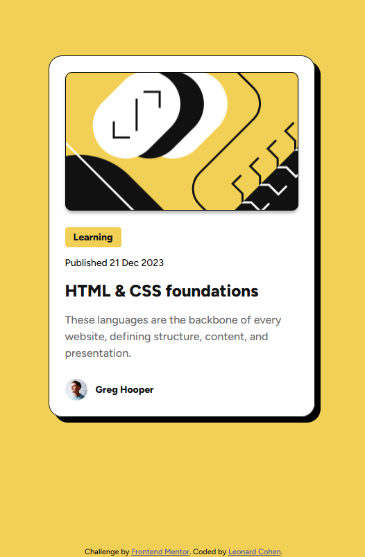

# Frontend Mentor - Blog preview card solution

This is a solution to the [Blog preview card challenge on Frontend Mentor](https://www.frontendmentor.io/challenges/blog-preview-card-ckPaj01IcS). Frontend Mentor challenges help you improve your coding skills by building realistic projects. 

## Table of contents

- [Overview](#overview)
  - [The challenge](#the-challenge)
  - [Screenshot](#screenshot)
  - [Links](#links)
- [My process](#my-process)
  - [Built with](#built-with)
  - [Implementation](#implementation)
  - [What I learned](#what-i-learned)
  - [Continued development](#continued-development)
- [Author](#author)

## Overview

### The challenge

Implement from design a blog preview card. The title should be a hyperlink with custom hover style.

### Screenshot

### Links

- Solution URL: [https://github.com/lenny131/blog-preview-card](https://github.com/lenny131/blog-preview-card)
- Live Site URL: [https://lenny131.github.io/blog-preview-card](https://lenny131.github.io/blog-preview-card)

## My process

### Built with

- HTML and CSS

### Implementation

This project uses plain HTML and CSS without any additional libraries or frameworks. All styling is in main.css; index.html contains only the page content with no inline styles.

In my solution to the previous challenge (QR code component), I did not set the width of the card (`<article>` element); instead, I set the width of the QR code image and the card is automatically sized to fit its contents.
This time, I set the width on the card itself, and the contents (including the blog image) are automatically sized to fit.

I used the following semantic elements:
- `<article>`: This project is probably the textbook example of using the `<article>` element.
- `<a>` and `<h1>`: I used both of these elements to represent the title of the article because the title has two semantic uses: it is a heading for the `<article>` element and it is a link to the actual article (this is just the preview).
- `<time>`: Using `<time>` instead of `
` better represents the publish date semantically as a date instead of just plain text.
- `<address>`: The `<address>` tag is used to identify the author of an article. It can contain contact information but in this case is only the author name.

### What I learned

The design for the desktop version of the page in the Figma design file included a border and box shadow for the blog image. It's unclear if this was intentional, since these elements are not specified in the mobile design, or at all in any of the sample jpg images.
Intentional or not, this provided an interesting challenge, as I had originally used the `` element for the blog image, and this caused issues with generating the border.

The design specified this as an inner border, so I set this border using the `box-shadow` property instead of using the normal border properties. However, the image was displaying on top and so the border was only partially visible.

I ended up using a `
` element with a background image instead. I think this is appropriate since the image has no semantic meaning - it is purely decorative.

### Continued development

My goal is to continue practicing HTML, CSS, and Javascript. Afterwards, I plan on learning React.

## Author

- Website - [Leonard Cohen](https://leonardmcohen.com)
- Frontend Mentor - [lenny131](https://www.frontendmentor.io/profile/lenny131)
